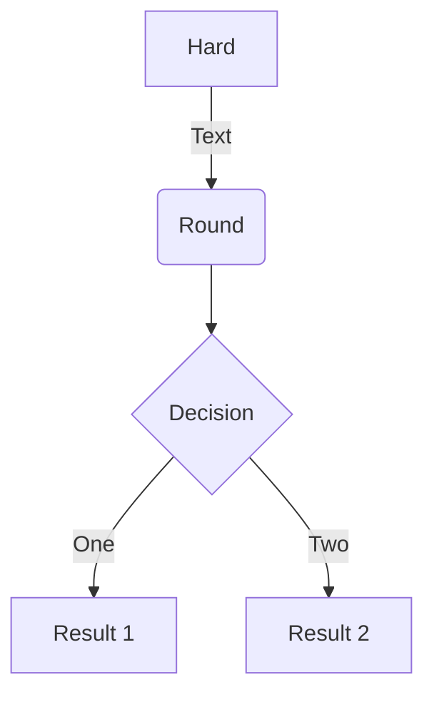
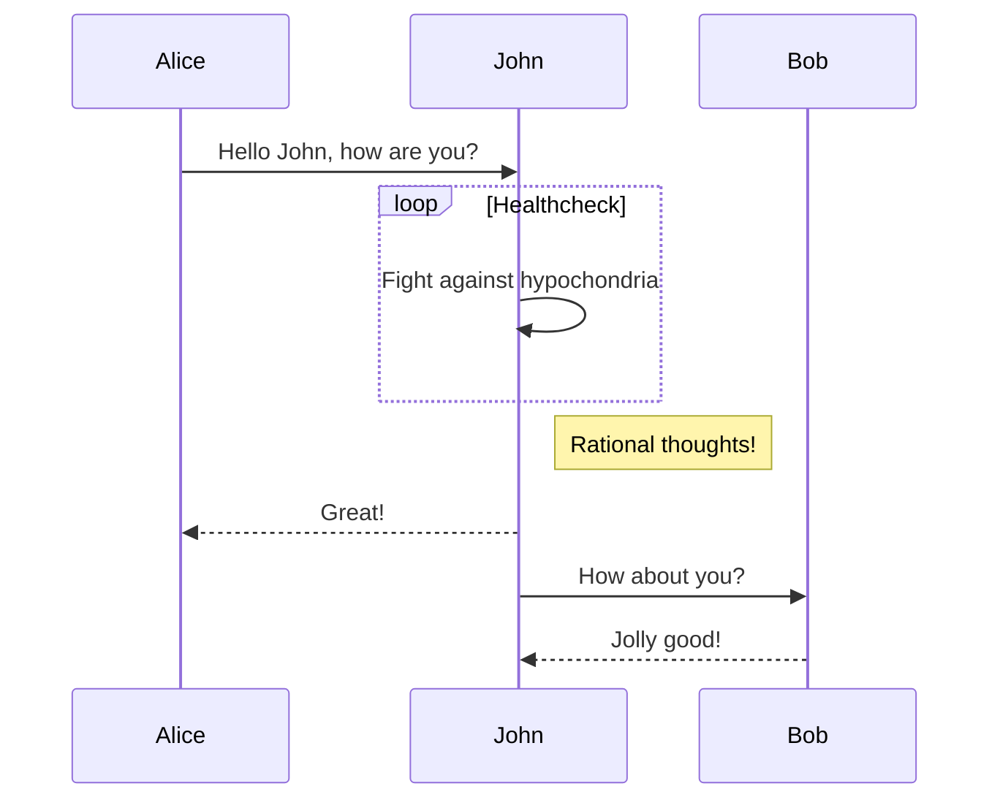
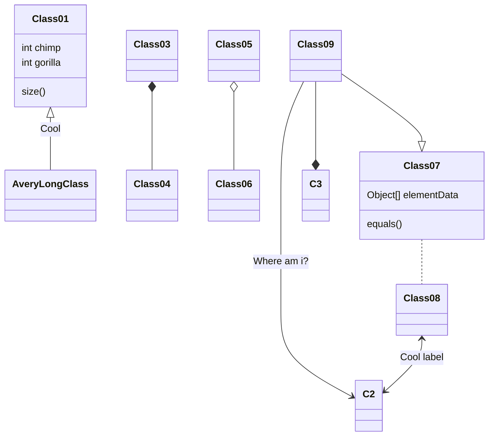
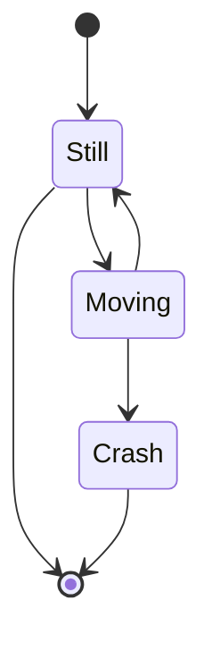

# 🗺️ Visual Odometry (VO) — One-Month Project Plan

A structured 4-week plan to implement a feature-based VO system from scratch. Aligned with classical VO architecture:

- Image Sequence  
- Feature Detection  
- Feature Matching  
- Motion Estimation  
- Local Optimization

---

## 📆 Week-by-Week Plan

### ✅ Week 1: Setup & Feature-Based VO Prototype

**🎯 Goal**: Get a working pipeline from image input to trajectory output.

- Set up development environment (Python + OpenCV + NumPy).
- Choose and load dataset (e.g., KITTI, EUROC, or your own camera).
- Load monocular or stereo frames.

**Implement:**

- Feature extraction (e.g., ORB or SIFT).
- Feature matching (e.g., FLANN or brute-force matcher).
- Estimate motion:
  - Essential matrix with **Five-Point RANSAC**.
  - Recover pose (rotation + translation).
- Triangulate 3D points from matched features.
- Visualize 2D/3D trajectory (Matplotlib / Open3D).

**✅ Deliverable**: Basic VO pipeline with visual trajectory on dataset.

---

### ✅ Week 2: Improve Robustness & Accuracy

**🎯 Goal**: Make the pipeline more robust and less sensitive to noise.

- Replace brute-force matching with:
  - KLT tracker (e.g., `cv2.calcOpticalFlowPyrLK`), or
  - Efficient matcher with ratio test.
- Add a motion model or frame-to-frame filtering.
- Tune RANSAC threshold to reduce outliers.
- Add **scale recovery** (using stereo baseline or known motion if monocular).

**✅ Deliverable**: Smoother and more consistent VO output across sequences.

---

### ✅ Week 3: Add Optimization & Visual Backend

**🎯 Goal**: Optimize motion estimation over multiple frames.

- Add a **pose graph** or **keyframe-based** structure.
- Integrate **Bundle Adjustment**:
  - Use libraries like [g2o](https://github.com/RainerKuemmerle/g2o) or [Ceres Solver](http://ceres-solver.org/).
- Optimize poses and 3D landmarks together.
- Keyframe selection/culling: keep one every N frames or when motion exceeds threshold.

**✅ Deliverable**: Refined, consistent map and camera trajectory.

---

### ✅ Week 4: Evaluation + Real-Time Extension

**🎯 Goal**: Evaluate system, improve performance, and test real-time capability.

- Compare estimated trajectory with ground truth using:
  - ATE (Absolute Trajectory Error)
  - RPE (Relative Pose Error)
- Plot error metrics and visualize drift.
- Optional:
  - Integrate IMU for better scale estimation.
  - Run real-time VO using a USB/RPi camera.
  - Add a basic ROS2 wrapper around the pipeline.

- Finalize code:
  - Write README, add example scripts.
  - Record and share video demos.

**✅ Deliverable**: Shareable, reproducible VO system with error plots and visual output.

---

## 🔧 Tools & Libraries Used

- Python 3, OpenCV
- NumPy, Matplotlib, Open3D
- g2o / Ceres (for optimization)
- Optional: ROS2, IMU tools

---

> 💡 **Tip**: You can extend this pipeline toward SLAM by adding loop closure detection and global optimization later.


## Charts

Hugo Blox supports the popular [Plotly](https://plot.ly/) format for interactive data visualizations. With Plotly, you can design almost any kind of visualization you can imagine!

Save your Plotly JSON in your page folder, for example `line-chart.json`, and then add the `` shortcode where you would like the chart to appear.

Demo:



You might also find the [Plotly JSON Editor](http://plotly-json-editor.getforge.io/) useful.

## Diagrams

Hugo Blox supports the _Mermaid_ Markdown extension for diagrams.

An example **flowchart**:

    ```mermaid
    graph TD
    A[Hard] -->|Text| B(Round)
    B --> C{Decision}
    C -->|One| D[Result 1]
    C -->|Two| E[Result 2]
    ```

renders as



An example **sequence diagram**:

    ```mermaid
    sequenceDiagram
    Alice->>John: Hello John, how are you?
    loop Healthcheck
        John->>John: Fight against hypochondria
    end
    Note right of John: Rational thoughts!
    John-->>Alice: Great!
    John->>Bob: How about you?
    Bob-->>John: Jolly good!
    ```

renders as



An example **class diagram**:

    ```mermaid
    classDiagram
    Class01 <|-- AveryLongClass : Cool
    Class03 *-- Class04
    Class05 o-- Class06
    Class07 .. Class08
    Class09 --> C2 : Where am i?
    Class09 --* C3
    Class09 --|> Class07
    Class07 : equals()
    Class07 : Object[] elementData
    Class01 : size()
    Class01 : int chimp
    Class01 : int gorilla
    Class08 <--> C2: Cool label
    ```

renders as



An example **state diagram**:

    ```mermaid
    stateDiagram
    [*] --> Still
    Still --> [*]
    Still --> Moving
    Moving --> Still
    Moving --> Crash
    Crash --> [*]
    ```

renders as



## Data Frames

Save your spreadsheet as a CSV file in your page's folder and then render it by adding the _Table_ shortcode to your page:

```go

```

renders as



## Did you find this page helpful? Consider sharing it 🙌
